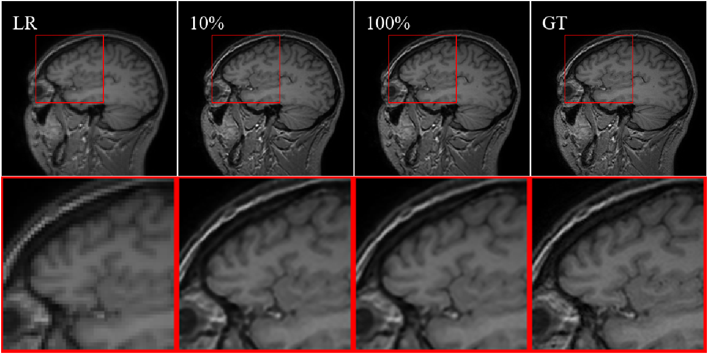
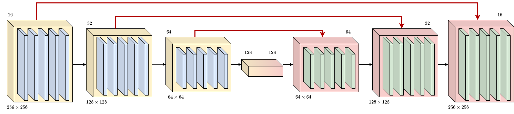

# Supplementary Material for EMBC2026
Supplementary Material for IEEE EMBC 
**Structural Loss Functions Enhance Super-Resolution Performance with Mixed MRI and Non-Domain Training Data**  {aurangau, friedrich.wetterling, anil.kokaram}@tcd.ie</samp

## Abstract
Magnetic Resonance Imaging (MRI) is an important tool for detecting medical conditions. Although low-field MRI scanners enable quick acquisition, resulting images are low resolution and blurry and noisy, requiring sophisticated upsampling methods. Deep Learning (DL) methods offer cost efficient, quick and high quality solutions. However, the impact of training data on brain MRI restoration quality, directly affecting diagnostic reliability remain under-explored. We explored different combinations of MRI and natural world images as part of the training data for DL-based methods aimed at upsampling Low-Resolution MRI scans by factors of 2 and 4. We showed that training lightweight Deep Neural Networks (DNNs) using only MRI scans significantly improved overall restoration quality measured by Peak Signal-to-Noise Ratio (PSNR), but not sharpness, leading us to examine the role of loss functions for generating sharper restorations. We designed and trained a lightweight U-Net based Super-Resolution (SR) architecture with widely used losses, i.e. Mean Squared Error (MSE), Mean Absolute Error (MAE) and Structural Similarity (SSIM) and incorporated a sharpness loss Q, originally designed for deblurring, but not MRI SR. We showed that incorporating such losses that explicitly target sharpness, not only led to visibly sharper restorations, but also to gains in overall quality of upsampled MRI.

## Impact of Domain Specific Data on Training Performance
Table 1 shows the restoration capabilities, in terms of PSNR, SSIM. The total number of images used was 27,547 crops of size 256 $\times$ 256. 

| Percent | PSNR | SSIM |
| ------- | ---- | ---- |
| 0       | 35.09 | 0.96 |
| 10      | 35.10 | 0.96 | 
| 20      | 35.12 | 0.96 | 
| 30      | 35.14 | 0.96 |
| 40      | 35.29 | 0.97 |
| 50      | 35.45 | 0.97 |
| 60      | 35.09 | 0.96 |
| 70      | 35.11 | 0.96 |
| 80      | 35.04 | 0.96 |
| 90      | 34.96 | 0.96 |
| 100     | 35.74 | 0.97 |

As can be seen from the above table, as the percentage of MRI images increases, so do quality metrics such as PSNR and SSIM. Table 2 gives a more detailed overview of the use of MRI data with respect to sharpness metrics such as $Q$.

| Percent | PSNR | SSIM | LPIPS | $Q$ |
| ------- | ---- | ---- | ----- | --- |
| 0       | 35.09 | 0.96 | 0.08 | 0.12 |
| 10      | 35.10 | 0.96 | 0.08 | 0.12 |
| 50      | 35.45 | 0.97 | 0.07 | 0.12 | 
| 100     | 35.74 | 0.97 | 0.07 | 0.12 | 

We must note that performing a paired t-test on the means of the model restored with 10% MRI data and 100% MRI data is statistically significant ($p$ < 0.05) in terms of PSNR and SSIM. It is not significant in terms of $Q$ which we use to measure sharpness. This has led us to examine the role of loss functions for producing visually sharper MRI scans.  
A visual example of the images upsampled by a factor of $\times$ 2 can be seen in Fig. 1. 

| ---- |
| Fig. 1. Impact of MRI data on overall MRI reconstruction |

As can be seen, as the percentage of MRI data increases, we start to regain certainn features and high-frequency information, thus leading to better PSNR and SSIM. We, however, do not see any increase in overall sharpness of the restorations.

## Model Architecture
For restoring the MRI scans, we developed a U-Net based model which is lightweight ($\sim$ 1.2 Million Trainable Parameters). The model, titled ARKNet-Lite, consists of three encoder blocks, followed by a bridge layer and three decoder blocks. Each encoder and decoder block consists of three convolution blocks. Convolution blocks, in turn, comprise of a single 3 $\times$ 3 convolution layer, followed by Batch Normalization and GeLU activation. For down-sampling in between layers, we use MaxPooling. The filter configuration was set to [16, 32, 64]. We noted that more filters led to better performance, but increased the model complexity, as well. A schematic diagram of the mdoel architecture can be seen in Fig2.

| ---- |
| Fig. 2. ARKNet-Lite Model Architecture |

## Generating Sharper Restorations

